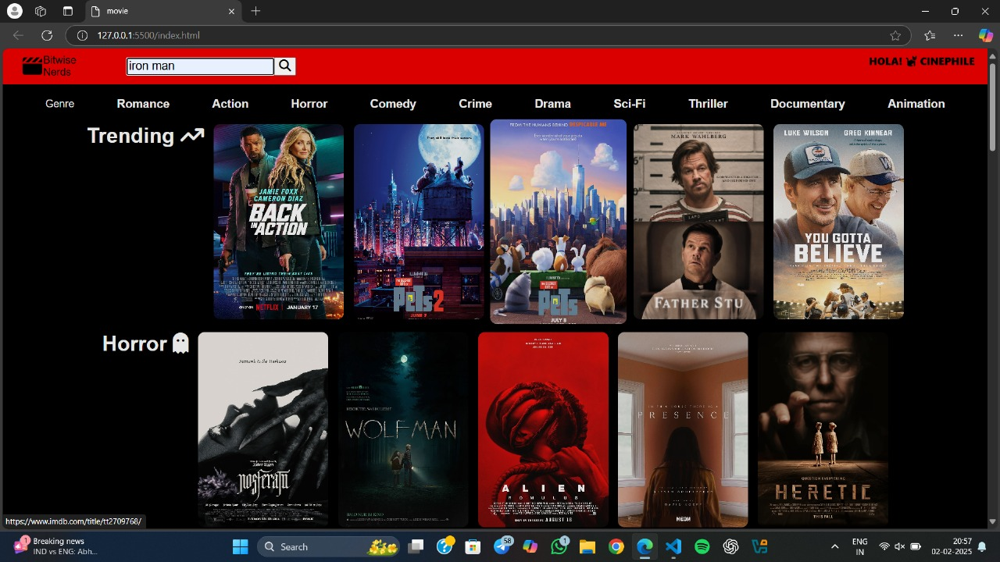
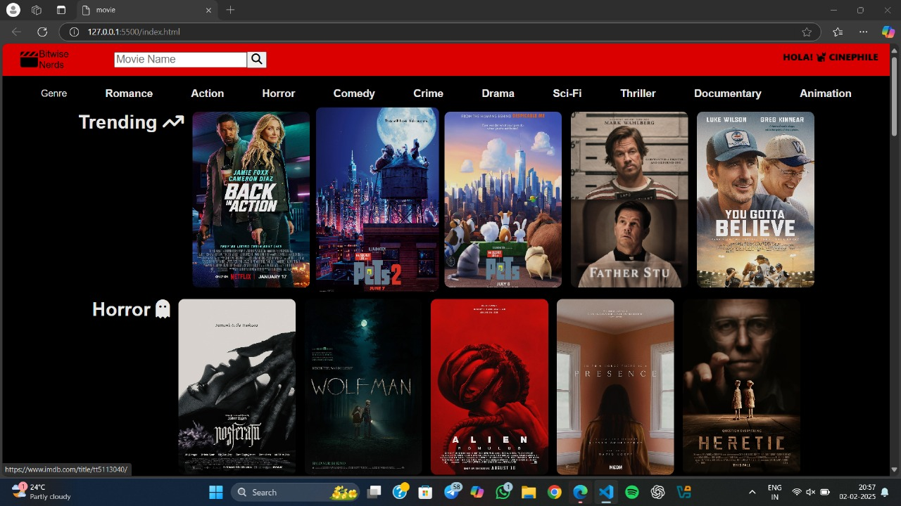
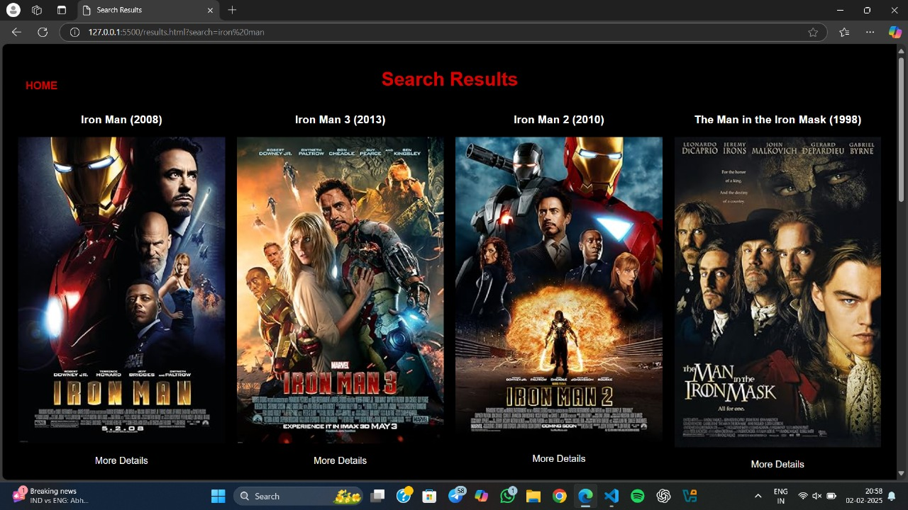

# Movie Discovery App
The Movie Discovery App is a simple website that helps you find trending movies, search by title, explore genres like Action, Comedy, and Horror, and check out top-rated movies on IMDb. You can also get personalized recommendations. The website is built with HTML, CSS, and JavaScript. To use it, just clone the repository, open the index.html file in your browser, and start exploring your favorite movies.

